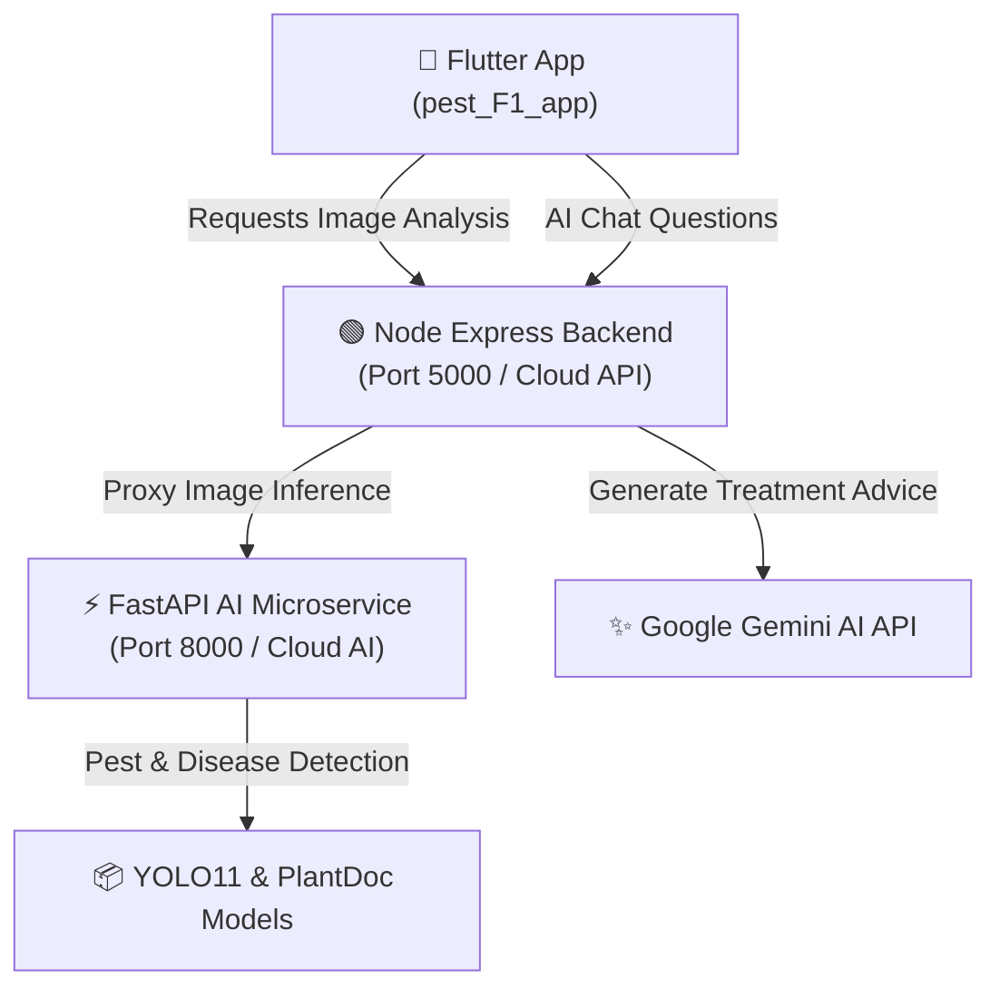

# 🌾 AgriScan — Smart AI Crop Pest & Disease Diagnostic System

**AgriScan** is an advanced AI-powered agricultural mobile and cloud platform designed to assist farmers, agronomists, and agricultural researchers in early crop pest detection, plant disease diagnosis, and treatment management directly from leaf photographs.

---

## 🌟 Key Features

- **⚡ Instant AI Pest & Disease Detection**:
  - Uses deep learning computer vision models (**YOLO11** and **PlantDoc**) to detect crop pests and leaf diseases.
  - Returns primary diagnosis, severity rating, confidence percentages, leaf damage classification, and discolored spot identification.

- **🤖 AgriScan AI Assistant (Gemini Powered)**:
  - Built-in conversational AI assistant providing organic remedies, chemical treatments, and preventive farming advice.
  - Features **Voice Input** (microphone) and **Voice Read-Aloud** (Text-to-Speech) for hands-free field use.

- **🌤️ Live Weather & Field Spraying Advice**:
  - Real-time time, date, local temperature, and humidity display with automated field spraying advisories.

- **📂 Local Scan History & Persistence**:
  - Saves all scan requests, AI results, and treatment advice locally in an SQLite database.
  - Sorted in reverse-chronological order (newest scan at the top) with quick single-item delete and "Clear All" options.

- **🌐 Multilingual Support**:
  - Supports 11 regional languages including English, Telugu (తెలుగు), Hindi (हिन्दी), Tamil (தமிழ்), Bengali (বাংলা), and more.

---

## 🏗️ Architecture Overview



---

## 🛠️ Technology Stack

| Layer | Technology |
| :--- | :--- |
| **Mobile App (Frontend)** | Flutter (Dart) — Cross-platform Android & iOS app |
| **Main API Backend** | Node.js & Express API — handles routing, auth, and Google Gemini AI |
| **AI Inference Service** | Python 3.10, FastAPI, PyTorch, Ultralytics YOLO11, PlantDoc |
| **Local Persistence** | SQLite (`sqflite`), SharedPreferences |

---

## 🚀 Quick Setup & Execution

### 1. Run Python AI Microservice (`ai-service`)
```bash
cd ai-service
pip install -r requirements.txt
python app.py
```
*Microservice starts at `http://127.0.0.1:8000`.*

### 2. Run Node API Backend (`backend`)
```bash
cd backend
npm install
npm start
```
*API server starts at `http://127.0.0.1:5000`.*

### 3. Run Mobile App (`pest_F1_app`)
```bash
cd pest_F1_app
flutter pub get
flutter run
```

---

## 📦 Build Release APK

To generate the standalone Android APK for distribution:

```bash
cd pest_F1_app
flutter build apk --release
```
*Output APK location*: `pest_F1_app/build/app/outputs/flutter-apk/app-release.apk`

---

## 📄 License
This project is licensed under the MIT License.
